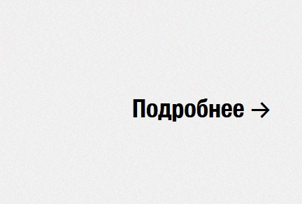
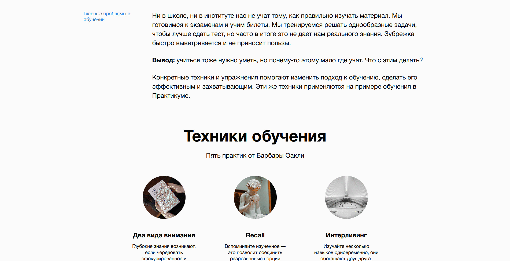

# Научиться учиться
Научиться учиться - проект, разработанный в процессе обучения в Яндекс.Практикум.

## Используемые технологии
В вёрстке сайта использовались:
* Flex-контейнеры
* Методология [БЭМ](https://ru.bem.info/)
* CSS-анимация:
  * Подвижные фоновые элементы

    
  * Мягкая анимация ссылок

    
* Подгружаемые шрифты

    
* YouTube API для просмотра видео-контента

    

## Планы по доработке

* Добавить полноценную поддержку мобильных устройств
* Сделать разделение на темную и светлую тему
* Добавить переключатель темы
